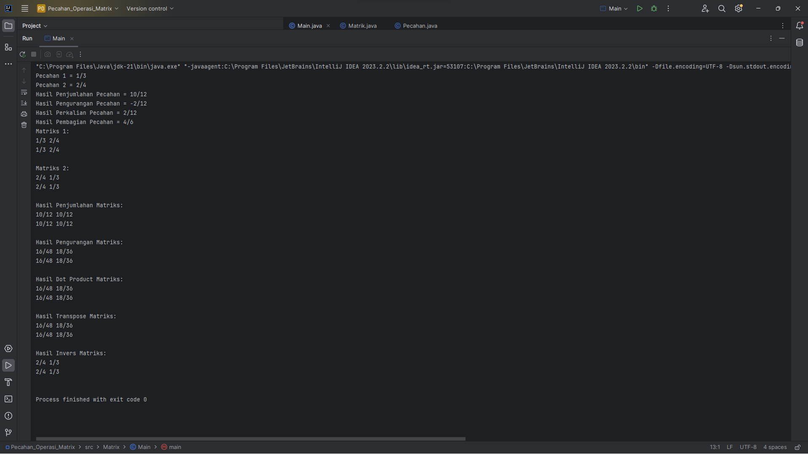

# Pecahan_Operasi_Matrix
## Afandi Ikhsyan Al Karim - 4522210032

### Deskripsi
Proyek ini merupakan implementasi operasi matematika pada pecahan (class Pecahan) dan matriks yang berisi pecahan (class Matrik). 

### Class Pecahan
Class `Pecahan` memiliki operasi berikut:
- Penjumlahan (`tambah`)
- Pengurangan (`kurang`)
- Perkalian (`kali`)
- Pembagian (`bagi`)

### Class Matrik
Class `Matrik` memiliki elemen yang berupa pecahan (`Pecahan`) dan operasi berikut:
- Penjumlahan Matriks (`tambah`)
- Pengurangan Matriks (`kurang`)
- Perkalian Matriks (`dot`)
- Transposisi Matriks (`transpose`)
- Inversi Matriks (`inverse`)

### Capture Program
Berikut adalah tangkapan layar hasil program:

### Catatan
Proyek ini merupakan contoh implementasi operasi matematika pada pecahan dan matriks menggunakan bahasa pemrograman Java. Operasi matriks seperti perkalian dan inversi memerlukan pemahaman yang mendalam tentang teori matriks, dan proyek ini memberikan gambaran umum tentang bagaimana operasi ini dapat diimplementasikan dalam kode Java.
